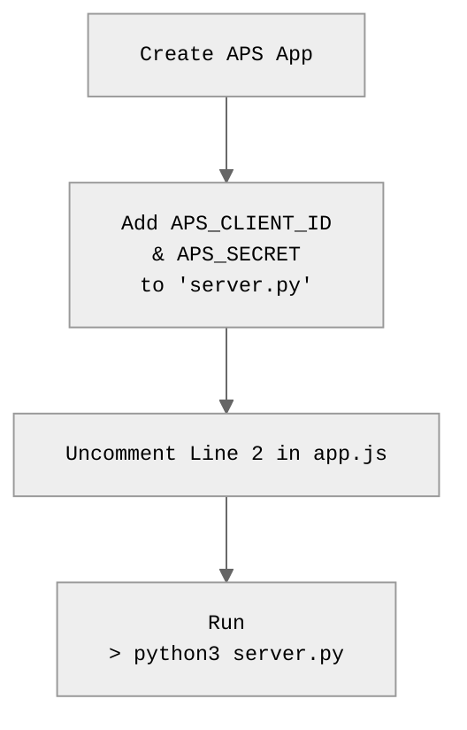
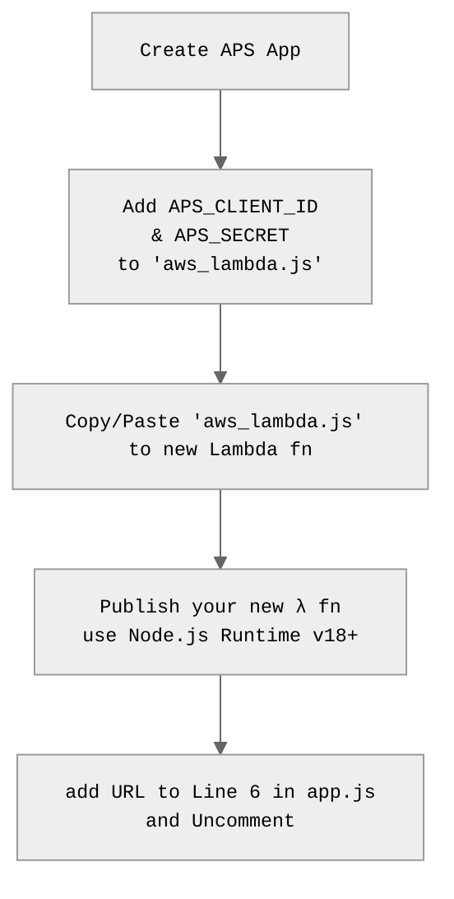

# tandem-api-hello-world
An example of a Basic Tandem Viewer in a browser, using 2 legged Auth.  
This Viewer can be embedded in PowerBi. 

## Live Demo: https://wallabyway.github.io/tandem-api-hello-world/


<br><br>

## SETUP

<table style="border:solid 1px"><td style="vertical-align:top;border:solid 1px" >

<h3>DEBUGGING - 

with local Python Server</h3>


</td> <td>

<h3>DEPLOY TO CLOUD - 

with AWS Lambda function</h3>


</td>
</table>

<br>
Finally, add your `APS_CLIENT_ID` to Tandem: 

https://wallabyway.github.io/dummy-docs/gettingStarted/intro.html#adding-permissions-to-tandem


### 2. CLIENT TESTING (Locally)

1. UnComment Line2 in [app.js](app.jsL2)
2. Run the python local static server, for debugging, like this...

```
> python3 server.py
> open http://localhost:8000
```

#### TEST 
> NOTES:
> Open browser with `/token` and check that your token is generated:  http://localhost:8000/token

> You may need to install urllib: like this `> pip3 install urllib3==1.26.6`


### 2. CLIENT SETUP (DEPLOY)

1. Comment Line2 and uncomment Line 6 in [app.js](app.jsL6).
2. Get your endpoint URL from AWS... 'xxxxxx'
3. and Add the URL to Line 6 in [app.js](app.jsL6), like this:

```
const token_URL = "https://xxxxxx.λ-url.us-west-2.on.aws";
```
4. Deploy your index.html and app.js to GITHUB PAGES and view the webpage


